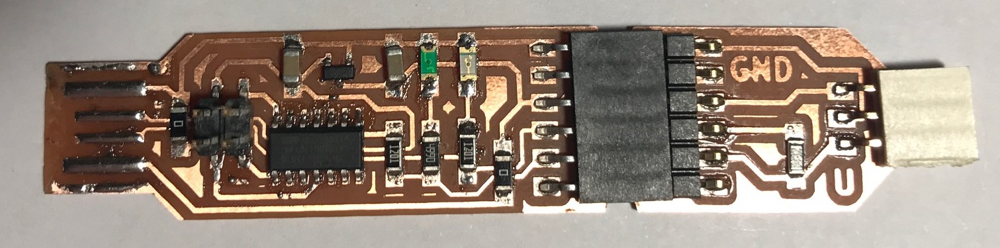
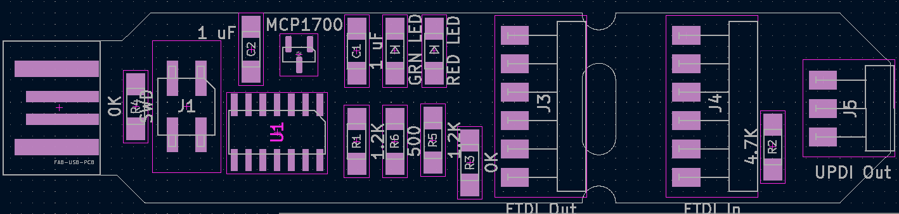

# Blinky Version
This version of the USB-to-UART-to-UPDI board includes LEDs to indicate serial port activity.  The red LED will turn on when this board has power: it will flicker *off* when data is being sent.  The green LED will turn on when the board you're talking to has power; it will flicker *off* when data is received.

 
 
 # Parts List
* [MCP1700T-3302E/TT LDO Voltage Regulator 5v->3.3v](https://www.mouser.com/ProductDetail/579-MCP1700T3302E-TT)
* [ATSAMD11C14A-SSNT SAMD microcontroller](https://www.mouser.com/ProductDetail/556-ATSAMD11C14ASSNT)
* [M20-8750242 2.54mm 2+2 DIL SMT header](https://www.mouser.com/ProductDetail/855-M20-8750242)
* [M20-8890645 2.54mm 6 way horzontal male SMT header](https://www.mouser.com/ProductDetail/855-M20-8890645)
* [M20-7910642R 2.54mm 6 way horzontal female SMT header](https://www.mouser.com/ProductDetail/855-M20-7910642R)  Qty: 2
* [1206 SMD resistor 4.7k](https://www.mouser.com/ProductDetail/652-CR1206-JW-472ELF)
* [1206 SMD resistor 1.2k](https://www.mouser.com/ProductDetail/652-CR1206FX-1201ELF) Qty: 2
* [1206 SMD resistor 500](https://www.digikey.com/en/products/detail/yageo/RC1206FR-07499RL/728944) Qty: 1
* [1206 SMD zero-ohm SMD jumper](https://www.mouser.com/ProductDetail/652-CR1206-J-000ELF) Qty: 2
* [1206 SMD 1uF ceramic capacitors](https://www.mouser.com/ProductDetail/187-CL31B105KAHNFNE) Qty: 2
* [1206 SMD Red Clear LED](https://www.digikey.com/en/products/detail/liteon/LTST-C150CKT/269214)
* [1206 SMD Green Clear LED](https://www.digikey.com/en/products/detail/liteon/LTST-C150GKT/269216)
