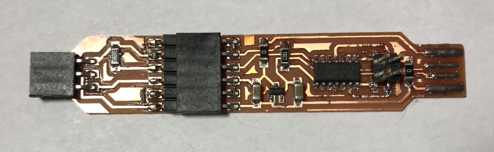
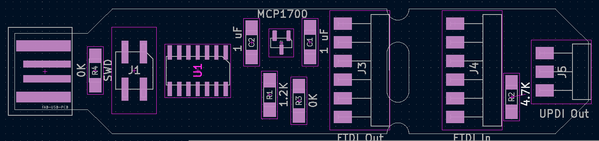

# SAMD-UPDI-breakaway
 A USB-to-UART-to-UPDI circuit board designed in KiCAD, based on Quentin Bolsee's [SAMD11C14 UART/UPDI programmer](https://fabacademy.org/2020/labs/ulb/students/quentin-bolsee/projects/samd11c_uart-updi/).  This version is designed so you can snap it in half to create a USB-to-UART adapter, and a UART-to-UPDI adapter, that can be used separately or joined together.  If you don't plan to use the "breakaway" feature, you don't need to solder in the 6-pin headers, and you might want to delete the internal slot to make it stronger.

* [Detailed assembly instructions](https://docs.google.com/document/d/1IBKZu-5q0hexmYGWNFWA64giY4mmglZQRK6Q2b19Nos/)
* [Quentin Bolsee's "SAMD11C_Serial" Arduino sketch](https://github.com/qbolsee/SAMD11C_serial): firmware for this board
* [Fab SAM Core for Arduino](https://github.com/qbolsee/ArduinoCore-fab-sam): Arduino core needed for Quentin's sketch

## USB Port Backplate
You may find that the USB port is a little too skinny to fit nicely into some USB ports.  You can 3-d print a [Back Plate](BackPlate.stl) and glue or double-sided-tape it to the board to make it fit better.

 # Parts List
* [MCP1700T-3302E/TT LDO Voltage Regulator 5v->3.3v](https://www.mouser.com/ProductDetail/579-MCP1700T3302E-TT)
* [ATSAMD11C14A-SSNT SAMD microcontroller](https://www.mouser.com/ProductDetail/556-ATSAMD11C14ASSNT)
* [M20-8750242 2.54mm 2+2 DIL SMT header](https://www.mouser.com/ProductDetail/855-M20-8750242)
* [M20-8890645 2.54mm 6 way horzontal male SMT header](https://www.mouser.com/ProductDetail/855-M20-8890645)
* [M20-7910642R 2.54mm 6 way horzontal female SMT header](https://www.mouser.com/ProductDetail/855-M20-7910642R)  Qty: 2
* [1206 SMD resistor 4.7k](https://www.mouser.com/ProductDetail/652-CR1206-JW-472ELF)
* [1206 SMD resistor 1.2k](https://www.mouser.com/ProductDetail/652-CR1206FX-1201ELF)
* [1206 SMD zero-ohm SMD jumper](https://www.mouser.com/ProductDetail/652-CR1206-J-000ELF)
* [1206 SMD 1uF ceramic capacitors](https://www.mouser.com/ProductDetail/187-CL31B105KAHNFNE) Qty: 2

# Blinky Version
There is also a [version of this board with LED lights](Blinky-version/) to indicate serial data activity.  You will need two additional 1206 1.2k resistors, and two 1206 1.2k LEDs.
